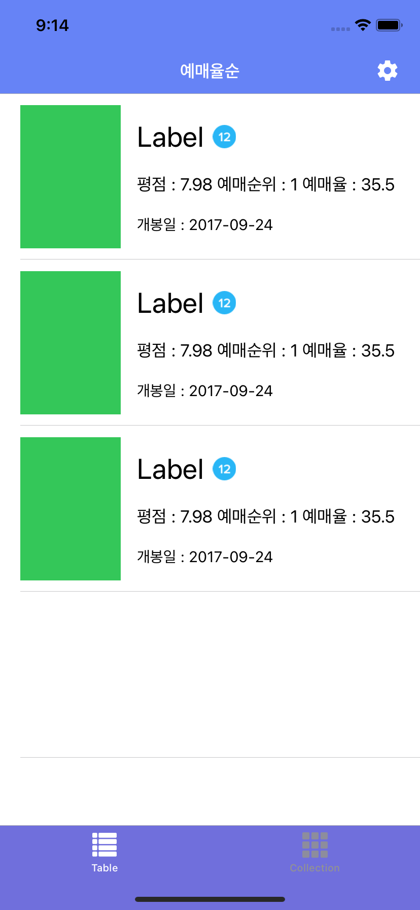
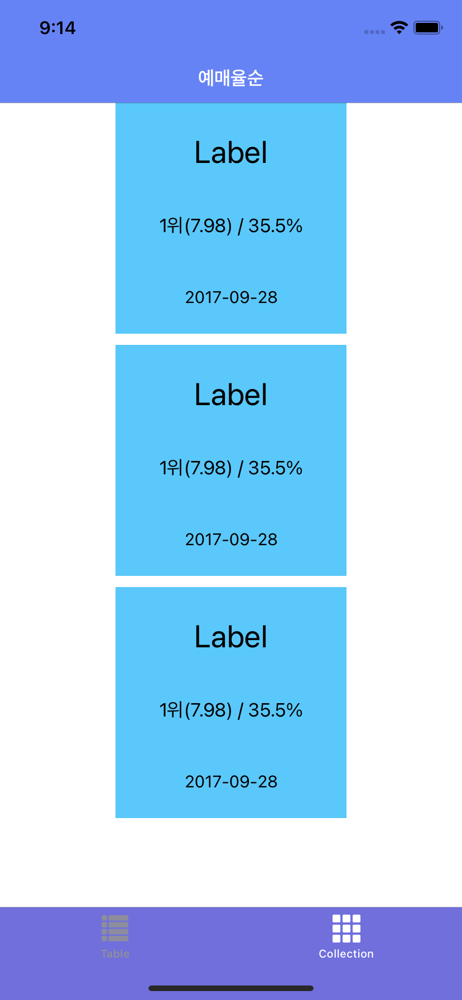
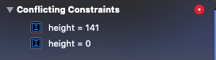

# 부스트코스 프로젝트E. BoxOffice

| Table Tab | Collection Tab |
| --------- | -------------- |
|  |  |

`CollectionViewCell`의 오토 레이아웃을 다시 잡아야 할 거 같다. `TableView`의 포스터 이미지는 크기를 임의로 지정(width: 99, height: 141)해도 문제가 생기지 않았는데, `CollectionView`에 있는 이미지 뷰는 `height`를 지정하면 아래 이미지처럼 오류가 뜬다. height = 141은 선택이 되서, 수정할 수가 있는데 밑에 있는 height = 0은 선택도 안되고, 어디에 잡힌 제약인지 알 수도 없다. 🤬

이번에는 가독성 좋게 코드를 작성하려고 노력하고 있다. 프로토콜 채택 후 구현은 `extension`으로 빼서 작성하고 있는데 `UICollectionViewDelegateFlowLayout`이 적용이 안된다. `viewDidLoad()`에서 객체를 만들어서 지정하는 건 되는데, 이건 또 왜 이러는지 모르겠다.