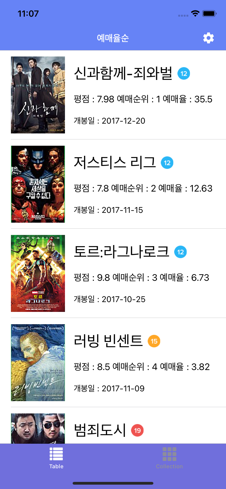
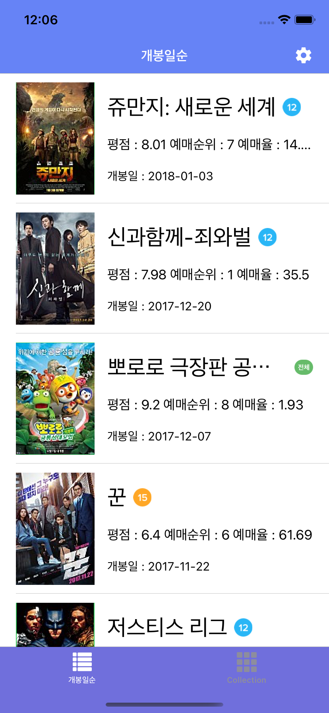

# 부스트코스 프로젝트E. BoxOffice

| 예매율순 | 개봉일순 |
| ------ | ------ |
|  |  |

화면 1에서 데이터를 가져오는 거까지 구현했다. 이번에는 최대한 코드를 깔끔하게 작성하는 것을 목표로 두고 있다. 

컬렉션 형태는 레이아웃을 다시 잡아야 하는데, 아직 못했다. `Notification Center`에 옵저버를 등록해놓으니까, 다른 탭에서 데이터가 바뀌어도(사용자가 정렬 방식을 선택할 때) 동일하게 적용이 된다. 이래서 Notification Center를 쓰는건가? 아무리 백날 이론, 개념 봐도 직접 몸으로 부딪혀봐야 제대로된 쓰임새를 알게 되는 거 같다.

`self.title`로 타이틀을 바꾸니, 탭 바의 타이틀과 네비게이션 컨트롤러 타이틀이 동시에 바뀐다. `self.navigationController?.title`로 하면 탭 바 타이틀만 바뀐다. 네비게이션 컨트롤러 타이틀만 바꾸려면 어떻게 해야하는거지 🤔