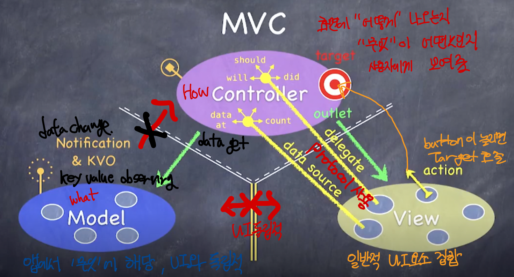

### Heap

** 컴퓨터 메모리 Heap과는 다른 용어!!!!

Heap은 데이터 중 가장 우선 순위가 높은 데이터를 항상 선택하기 위한 데이터 구조이다

따라서 완전 이진 트리 형태를 갖추고 있고 배열 구현이 가능하다

힙 데이터 구조는 heap invariant 또는 heap property 라고 불리는 조건을 **항상 만족**해야 한다

* Max Heap 

  가장 큰 Value가 가장 높은 우선순위

  부모 노드는 항상 자식 노드보다 크거나 같아야 하고 루트 노드는 가장 큰 Value 여야 한다

* Min Heap

  가장 작은 Value가 가장 높은 우선순위

  부모 노드는 항상 자식 노드보다 작거나 같아야 하고 루트 노드는 가장 작은 Value 여야 한다

Heap은 앞서서 말했듯이 완전 이진 트리임으로 모든 Level이 노드로 채워져 있어야 한다 (마지막 Level 예외)

배열을 사용해 Level을 나눠 보면 각 Level의 노드는 이전 Level의 노드 보다 2배더 많다

* Left Child Node = 2*index + 1    
* Right Child  Node = 2*index + 2
* Parent Node = (index - 1) / 2

  
  

* Remove

1. 루트 노드와 마지막 노드 Swap

  
  

2. 부모 노드가 자식 노드보다 크거나 같을 때까지 다음 Level로 이동하면서 Swap

  
  

* Insert

  Insert는 비교적 Remove에 비해 간단하다

  1. 마지막 노드에 New Value 추가
  2. 부모 노드와 비교 후 값이 크다면 Swap 작다면 Stop
  3. 부모 노드가 루트노드일 때까지 반복

  

    
    
  

  
  

### MVC

* Model 

  앱에서 **무엇**에 해당하는 UI와 독립적인 객체

* View 

  Controller의 하인

  UIButton, UILabel 등 UI에 관련된 것

* Controller

  앱에서 **어떻게** 화면에 그려지는지
  
  Model과 View 사이에서 소통?

* API - Application Programming Interface

  클래스 안의 모든 메소드와 인스턴스 변수의 리스트

  Public Api - 다른 클래스가 사용할 수있도록 Public 화 시킨 메소드와 인스턴스

